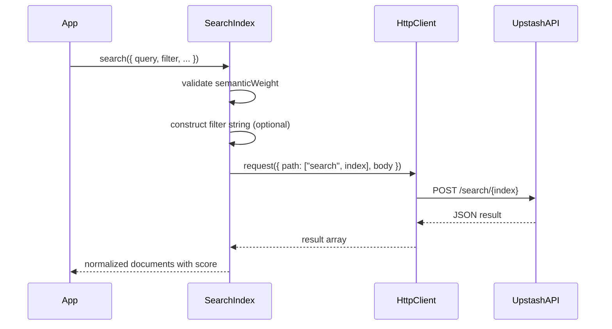

Upstash Search JS is a thin HTTP client built around a few focused modules: a platform-specific `Search` wrapper, a shared `Search` core that composes a `SearchIndex`, a small HTTP client with retry and cache controls, and a filter builder that turns typed filter trees into the string syntax expected by the REST API.

```mermaid
graph TD
  A[platforms/nodejs.ts] -->|extends| B[search.ts]
  C[platforms/cloudflare.ts] -->|extends| B[search.ts]
  B --> D[search-index.ts]
  B --> E[@upstash/vector Index]
  D --> F[client/search-client.ts]
  D --> G[client/metadata.ts]
  F --> H[fetch + REST API]
```

**Key Design Decisions**
- **Platform-specific entry points**: `src/platforms/nodejs.ts` and `src/platforms/cloudflare.ts` create a `Search` instance with runtime-appropriate defaults for telemetry and cache. This keeps the core `Search` class (`src/search.ts`) clean and portable, while letting each platform decide how to read credentials and detect runtime details.
- **Composition over duplication**: The core `Search` class constructs a `@upstash/vector` `Index` (`src/search.ts`) and shares the same underlying HTTP client. `SearchIndex` (`src/search-index.ts`) receives both the raw HTTP client and the vector index so it can use REST endpoints for search and the Vector SDK for fetch/delete/range/reset APIs. This avoids duplicating REST utilities while still exposing a concise Search‑specific API.
- **Typed filter trees**: The filter system in `src/client/metadata.ts` defines a `TreeNode` type that merges content and metadata fields and enforces mutually exclusive operations at the type level. It then translates that type-safe structure into a single REST filter string via `constructFilterString`. This lets you build complex filters without manually concatenating strings.
- **Retry and cache as first-class config**: `src/client/search-client.ts` defines `RequesterConfig` and `RetryConfig`, then normalizes them into a concrete retry plan. The implementation explicitly sets a default exponential backoff (e.g., `Math.exp(retryCount) * 50`) and keeps cache policy in the request options.

**How the Pieces Fit Together**
1. **Search instance creation**: You instantiate `Search` from `src/platforms/nodejs.ts` or `src/platforms/cloudflare.ts`. These constructors validate credentials, set telemetry headers, and create an `HttpClient` with retry/cache options.
2. **Index selection**: `Search.index()` from `src/search.ts` creates a `SearchIndex` that is scoped to a namespace (index name). This isolates document operations per index.
3. **Document operations**: `SearchIndex` provides `upsert`, `fetch`, `search`, `range`, `reset`, and `deleteIndex`. Search requests are sent directly via `HttpClient` to REST endpoints (`/search/{index}` or `/upsert-data/{index}`). Fetch/range/delete/reset use the `@upstash/vector` `Index` with a namespace set to the index name.
4. **Filtering**: If you pass a structured filter object to `SearchIndex.search`, it is converted to the REST filter expression by `constructFilterString` (`src/client/metadata.ts`). The resulting string is included in the POST body for the search request.

**Request Lifecycle (Search)**


The result is a compact, predictable SDK surface that stays close to the REST API while still giving you typed documents and helper methods for common index tasks.
