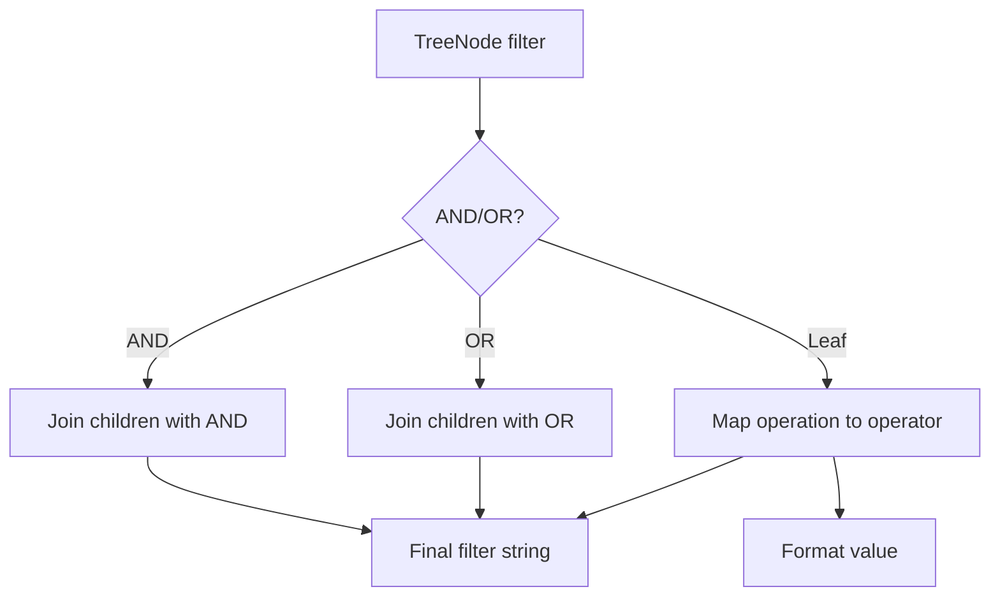

Filters let you narrow search results by content fields or metadata fields. Upstash Search JS offers a typed filter tree (`TreeNode`) that compiles into the string expression expected by the REST API. This gives you strong TypeScript guidance while still producing the exact filter syntax the service requires.

**Why this exists**
Search filters are easy to get wrong when they are built as raw strings—especially when mixing `AND`/`OR`, array operators, and metadata fields. The filter tree in `src/client/metadata.ts` enforces mutually exclusive operations (e.g., you can’t use `equals` and `in` at the same time for a field) and generates the correct string representation.

**How it relates to other concepts**
- `SearchIndex.search` accepts `filter` as either a string or a `TreeNode` object.
- The filter compiler (`constructFilterString`) is called inside `SearchIndex.search` before the REST call is made.
- Metadata fields are merged into the content type and referenced with the `@metadata.` prefix.

**Internal mechanics**
`TreeNode` is defined in `src/client/metadata.ts` as a recursive type:
- A leaf is a single field with a single operation (`equals`, `glob`, `in`, etc.).
- A tree node can also be `{ AND: TreeNode[] }` or `{ OR: TreeNode[] }`.
- Metadata fields are mapped as `@metadata.<key>` so filters can safely target content and metadata together.

`constructFilterString` walks the tree recursively and uses an `operationMap` to produce the filter string. Arrays are formatted as `(...)` and string values are wrapped in single quotes. Invalid or missing operations throw an error.



**Basic usage**
```ts index.ts
import { Search } from "@upstash/search";

type Content = { title: string; category: "classic" | "modern" };

type Meta = { year: number };

const client = new Search({
  url: process.env.UPSTASH_SEARCH_REST_URL!,
  token: process.env.UPSTASH_SEARCH_REST_TOKEN!,
});

const index = client.index<Content, Meta>("movies");

const results = await index.search({
  query: "space",
  filter: { AND: [{ category: { equals: "classic" } }] },
});
```

**Advanced usage: mixing metadata, arrays, and nested logic**
```ts index.ts
import { Search } from "@upstash/search";

type Content = { title: string; tags: string[] };

type Meta = { rating: number; region: string };

const client = new Search({
  url: process.env.UPSTASH_SEARCH_REST_URL!,
  token: process.env.UPSTASH_SEARCH_REST_TOKEN!,
});

const index = client.index<Content, Meta>("content");

const results = await index.search({
  query: "edge runtime",
  filter: {
    AND: [
      { tags: { contains: "serverless" } },
      { "@metadata.rating": { greaterThanOrEquals: 4.5 } },
      {
        OR: [
          { "@metadata.region": { in: ["us-east", "eu-west"] } },
          { title: { glob: "*edge*" } },
        ],
      },
    ],
  },
});
```

<Callout type="warn">`constructFilterString` throws if a filter leaf has no operation or if a value is `undefined`. When building filters from user input, validate and normalize values before you build the tree to prevent runtime errors.</Callout>

<Accordions>
<Accordion title="Typed filters vs raw strings">
Typed filters make refactoring safer because field names are derived from your content and metadata types. However, they add TypeScript complexity and sometimes require explicit casting when you want to build filters dynamically. Raw strings are more flexible, but they increase the risk of syntax errors and make it harder to catch mistakes early. In teams that value strong typing, the filter tree is usually worth the extra verbosity.
</Accordion>
<Accordion title="Metadata prefix trade-offs">
Using `@metadata.` keeps the filter namespace explicit and avoids collisions between content fields and metadata fields. The trade‑off is that you must reference metadata fields with a string key, which can be more error‑prone in dynamic code. If you build filters programmatically, consider centralizing metadata field names in constants to avoid typos. This also makes it easier to update field names if your schema evolves.
</Accordion>
<Accordion title="Nested logic complexity">
Complex `AND`/`OR` trees map cleanly to the REST syntax, but they can become hard to reason about in large queries. It is often better to build and test smaller filter fragments and then compose them. When you do use deep nesting, ensure you have tests or fixtures that show expected filter strings so regressions are visible. This makes it easier to confirm that the boolean logic still matches your business rules.
</Accordion>
</Accordions>
