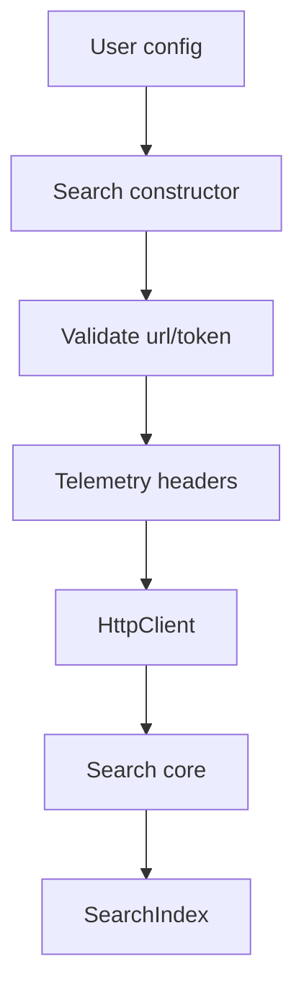

The Search client is the entry point to the SDK. It is responsible for validating credentials, attaching headers, and creating the HTTP requester that every index operation uses. There are two platform wrappers—Node.js and Cloudflare Workers—that both extend the same core class but differ in how they read environment variables and determine telemetry headers.

**Why this exists**
Upstash Search is accessed over HTTP. The client abstracts away authorization headers, retry logic, and runtime differences so you can focus on indexing and querying. Without it, each function call would need to manually build requests and handle transient network failures.

**How it relates to other concepts**
- The `Search` client creates a `SearchIndex` for each namespace via `Search.index()` in `src/search.ts`.
- `SearchIndex` uses the client’s `HttpClient` to call `/search` and `/upsert-data` endpoints and the `@upstash/vector` SDK for other index operations.
- The filter system (`TreeNode` + `constructFilterString`) plugs into `SearchIndex.search` to add typed filtering.

**Internal mechanics**
The platform-specific `Search` class in `src/platforms/nodejs.ts` and `src/platforms/cloudflare.ts`:
- Validates `url` and `token` and throws `UpstashError` if missing.
- Warns if the credentials contain whitespace, which can break auth headers.
- Builds telemetry headers using `src/client/telemetry.ts` (Node.js adds runtime details; Cloudflare sets a fixed platform value).
- Constructs an `HttpClient` (`src/client/search-client.ts`) with `baseUrl`, `headers`, `retry`, and `cache` settings.

`HttpClient` normalizes retry config: if `retry` is `false` it attempts only once; otherwise it defaults to 5 retries with exponential backoff (`Math.exp(retryCount) * 50`). It then POSTs JSON to the REST endpoint and throws an `UpstashError` on non‑OK responses.



**Basic usage**
```ts index.ts
import { Search } from "@upstash/search";

const client = new Search({
  url: process.env.UPSTASH_SEARCH_REST_URL!,
  token: process.env.UPSTASH_SEARCH_REST_TOKEN!,
});

const index = client.index("movies");
```

**Advanced usage: custom retry + cache**
```ts index.ts
import { Search } from "@upstash/search";

const client = new Search({
  url: process.env.UPSTASH_SEARCH_REST_URL!,
  token: process.env.UPSTASH_SEARCH_REST_TOKEN!,
  retry: {
    retries: 3,
    backoff: (count) => 100 + count * 200,
  },
  cache: "no-store",
  enableTelemetry: false,
});

const index = client.index("support-articles");
```

<Callout type="warn">If you pass `url` or `token` values with leading or trailing whitespace, the client will warn you but still attempt requests. Trim secrets in your deployment pipeline and avoid multiline environment variables to prevent intermittent authentication failures.</Callout>

<Accordions>
<Accordion title="Telemetry trade-offs">
Telemetry headers are enabled by default so Upstash can understand SDK usage and runtime patterns. In `src/platforms/nodejs.ts`, the SDK reads `UPSTASH_DISABLE_TELEMETRY` and, if set, removes those headers entirely. Disabling telemetry reduces outbound metadata but also makes it harder to diagnose runtime-specific issues and measure SDK performance across environments. If you disable it, consider adding your own monitoring around HTTP failures and retries so you still have visibility into request reliability.
</Accordion>
<Accordion title="Retry policy trade-offs">
The default exponential backoff in `src/client/search-client.ts` is safe for most serverless workloads, but it increases tail latency when the network is flaky. Reducing retries can improve worst‑case latency but risks more visible failures at peak load. For user‑facing search, a small number of retries (1‑3) usually gives a better balance. For background ingestion, longer retries can be acceptable because throughput matters more than response time.
</Accordion>
<Accordion title="Cache control trade-offs">
The HTTP client exposes `cache` settings for runtimes that respect the Fetch API cache semantics. Using `no-store` avoids stale reads but also prevents edge caching of identical searches. In read‑heavy workloads with mostly stable content, `force-cache` can improve latency at the cost of freshness. Always align cache policy with the consistency needs of your content; for example, ingestion-heavy apps should use `no-store` while a static docs search might tolerate cached search results for short periods.
</Accordion>
</Accordions>
